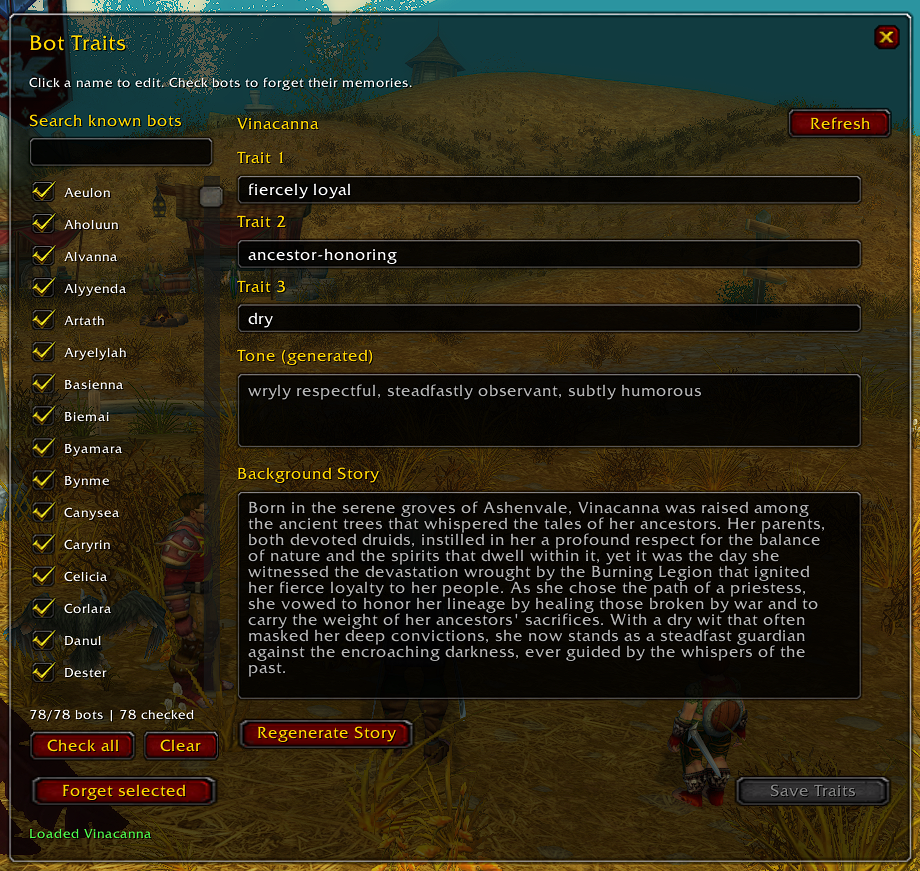

<p align="center">
  
</p>

# Azeroth Voices Addon (Turtle WoW 1.18.1)

Azeroth Voices is a World of Warcraft 1.12.1 / Turtle WoW 1.18.1 (Interface: 11200) addon that provides a single-window companion UI for the [`mod-azeroth-voices`](https://github.com/Ildourol/mod-azeroth-voices) vMaNGOS / TortoiseWoW module.

It lets players manage persistent personality traits, tones, background stories, and shared memories for PlayerBots they have encountered in the world.

---

## What It Does

- **Known Bots Roster:** Lists PlayerBots the player has interacted with (grouped, whispered, or encountered).
- **Edit Personality Traits:** View and edit each bot's three persistent personality traits.
- **Generated Tone:** Displays the dynamic tone generated server-side by the LLM provider based on the bot's traits and class/race lore.
- **Background Story:** View the bot's generated backstory and request background regeneration on demand.
- **Bulk Forget:** Check one or multiple bots to selectively erase shared memories and conversation history without altering their persistent personality or server-wide sentiment.
- **Single Movable Window:** Clean, draggable, lightweight UI designed specifically for the Vanilla 1.12 / Turtle WoW interface.
- **Automatic Migration:** Seamlessly migrates window position and selected-bot state from legacy `ChatterDB` to `AzerothVoicesDB`.

---

## Requirements

- **Client:** Turtle WoW 1.18.1 client (Vanilla Interface 11200).
- **Server:** TortoiseWoW / vMaNGOS server running `mod-azeroth-voices` with `AzerothVoices.Addon.Enable = 1`.
- **Roster Discovery:** You must have chatted or grouped with at least one bot before that bot appears in your known roster.

---

## Installation

### 1. Locate Addon Files

In the repository, the addon is bundled under:

```
client/AzerothVoices/
```

### 2. Copy to Interface/AddOns

Copy the `AzerothVoices` directory into your Turtle WoW installation under:

```
<Turtle WoW install>\Interface\AddOns\AzerothVoices\
```

Inside that folder, you must see:

```
AzerothVoices\
├── AzerothVoices.toc
├── AzerothVoices.lua
├── AzerothVoicesRoster.lua
├── AzerothVoicesUI.lua
├── README.md
└── images\
```

> **Note:** The folder name must be exactly `AzerothVoices` (matching `AzerothVoices.toc`).

### 3. Enable the Addon

1. Restart or start the Turtle WoW client.
2. At the character selection screen, click the **AddOns** button in the bottom-left corner.
3. Verify **Azeroth Voices** is listed and its checkbox is enabled.
4. If prompted, ensure "Load out of date AddOns" is checked (the TOC is tagged `11200`).
5. Enter the world.

---

## Usage

### Slash Commands

Open or close the window at any time using:

```text
/azerothvoices
/avvoices
```

For backward compatibility, the legacy slash commands `/chatter` and `/llmc` are also recognized as UI aliases.

### Interface Walkthrough

- **Search & Roster (Left):** Search known bots with the search box. Click any name to load that bot's profile.
- **Checkboxes & Forget (Left):** Check individual bots (or click **Check all**) and click **Forget selected** to erase shared memories and conversation history. A confirmation dialog shows the target count and names before proceeding.
- **Edit Traits (Right):** Edit Trait 1, Trait 2, and Trait 3. Pressing Tab cycles through the three traits. Click **Save Traits** to save changes; saving prompts for confirmation and instructs the server to regenerate the bot's tone and backstory.
- **Regenerate Story (Right):** Click **Regenerate Story** to regenerate only the background story while preserving existing traits and tone.
- **Refresh (Top Right):** Requests a fresh roster from the server.

---

## Protocol and Architecture

### Dual Transport Architecture

The addon connects to `mod-azeroth-voices` using private in-game control transports without requiring GM security privileges:

1. **Native Turtle WoW Transport (`.avaddon`):**
   - **Client Request:** The addon transmits chunked frames via Say chat:
     ```text
     .avaddon 1 <request-id> <part-index> <part-count> <chunk>
     ```
     The server reassembles up to 8 parts (max 2 KiB) per player, automatically suppresses all `.avaddon` control frames before chat broadcast, and enforces a 10-second expiration window.
   - **Server Response:** The server delivers responses using native addon messages:
     ```text
     Player::SendAddonMessage("AZEROTH_VOICES", frame)
     ```
     Frames are formatted as:
     ```text
     1\t<request-id>\t<message-index>\t<part-index>\t<part-count>\t<chunk>
     ```
     Chunks are dynamically sized so that the prefix plus frame payload remains strictly at or below 255 bytes.
   - **Security & Rejection:** The client accepts responses exclusively with the exact `AZEROTH_VOICES` prefix, `GUILD` transport, and verified sender matching `UnitName("player")` to reject any forged messages.

2. **Legacy Compatibility Channel (`.llmc`):**
   - Older Chatter clients sending `.llmc` through Say continue to receive system-message responses prefixed with `CHATTER_ADDON `.
   - Both transports share the exact same server-side logical engine and database models.

---

## Troubleshooting

- **The addon does not appear in the AddOns list:** Check that the folder is named `AzerothVoices` and is directly inside `Interface\AddOns\`.
- **The roster is empty:** You must interact with at least one PlayerBot (whisper, Say, or party/raid group) for it to be registered in your contact roster (`azeroth_voices_addon_contacts`).
- **Saving traits displays an error:** Ensure the server has `AzerothVoices.Addon.Enable = 1` and `AzerothVoices.Personality.Enable = 1` configured in `mod-azeroth-voices.conf`.
